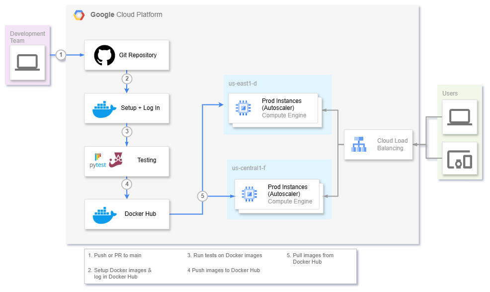

# **CI/CD Pipeline Documentation**

## **1. Introduction**
This document outlines the Continuous Integration (CI) and Continuous Deployment (CD) pipeline implemented for the project. The pipeline is configured using GitHub Actions for automation and Docker for containerized application deployment. Automated testing for the backend is planned using **pytest**, and **jest** will be used for frontend testing. Additionally, the code will be deployed on Google Cloud Platform, specifically on a Compute Engine instance.

## **2. System Design**
<figure>
  
  <figcaption><strong>Note:</strong> This design outlines the use of Google Cloud Platform (GCP) for deployment, which is planned for future implementation, rather than local deployment at this stage.</figcaption>
</figure>
<br>
<br>
The CI/CD pipeline consists of the following key stages:

### **Continuous Integration (CI)**
1. **Code Checkout**: Pulls the latest changes from the Git repository.
2. **Docker Setup**: Ensures that Docker and Docker Compose are installed.
3. **Docker Hub Authentication**: Logs into Docker Hub using secure credentials.
4. **Build Docker Images**: Builds separate images for the backend and frontend services.
5. **Push to Docker Hub**: Uploads the built images to Docker Hub for deployment.
6. **Automated Tests**: **pytest** will be used for backend testing, and **jest** will be used for frontend testing.
7. **Future Enhancements**: Implement additional automated tests for both frontend and backend.

### **Continuous Deployment (CD)**
1. **Code Checkout**: Pulls the latest changes from the Git repository.
2. **Docker Setup**: Ensures that Docker and Docker Compose are installed.
3. **Docker Hub Authentication**: Logs into Docker Hub using secure credentials.
4. **Pull Latest Images**: Retrieves the latest backend and frontend images from Docker Hub.
5. **Deploy Containers**: Uses Docker Compose to start the services.
6. **Future Enhancements**: Implement automated testing after deployment using **pytest** and **jest**.

## **3. CI/CD Workflow Implementation**

### **3.1. CI Pipeline**
Located in `.github/workflows/ci.yml`, the CI pipeline triggers on any push to the `main` branch. It consists of the following steps:

1. **Check Out Repository**
   ```yaml
   - name: Check out repository
     uses: actions/checkout@v4
   ```

2. **Set Up Docker**
   ```yaml
   - name: Set up Docker
     run: |
       docker --version
       docker-compose --version
   ```

3. **Log In to Docker Hub**
   ```yaml
   - name: Log in to Docker Hub
     run: echo "${{ secrets.DOCKER_PASSWORD }}" | docker login -u "${{ secrets.DOCKER_USERNAME }}" --password-stdin
   ```

4. **Build and Push Backend & Frontend Docker Images**
   ```yaml
   - name: Build backend Docker image
     run: docker build -t mallisho/catalog:backend-latest ./backend
     
   - name: Build frontend Docker image
     run: docker build -t mallisho/catalog:frontend-latest ./frontend
     
   - name: Push backend image
     run: docker push mallisho/catalog:backend-latest
     
   - name: Push frontend image
     run: docker push mallisho/catalog:frontend-latest
   ```

5. **Automated Tests (To be implemented)**
   - **Backend Tests (pytest)**
     ```yaml
     - name: Run backend tests
       run: docker run --rm mallisho/catalog:backend-latest pytest /app/tests
     ```

   - **Frontend Tests (jest)**
     ```yaml
     - name: Run frontend tests
       run: docker run --rm mallisho/catalog:frontend-latest npm test
     ```

### **3.2. CD Pipeline**
Located in `.github/workflows/cd.yaml`, the CD pipeline triggers on any push to the `main` branch. It includes:

1. **Check Out Repository**
   ```yaml
   - name: Check out the repository
     uses: actions/checkout@v4
   ```

2. **Set Up Docker**
   ```yaml
   - name: Set up Docker
     run: |
       docker --version
       docker-compose --version
   ```

3. **Log In to Docker Hub**
   ```yaml
   - name: Log in to Docker Hub
     run: echo "${{ secrets.DOCKER_PASSWORD }}" | docker login -u "${{ secrets.DOCKER_USERNAME }}" --password-stdin
   ```

4. **Pull and Deploy Containers**
   ```yaml
   - name: Pull latest images
     run: |
       docker pull mallisho/catalog:backend-latest
       docker pull mallisho/catalog:frontend-latest
     
   - name: Start containers
     run: docker-compose up -d
   ```

## **4. Configuration Files**

### **4.1. Docker Compose Configuration**
The `docker-compose.yml` file defines the multi-container setup:

```yaml
services:
  backend:
    image: mallisho/catalog:backend-latest
    ports:
      - "8000:8000"
    env_file:
      - ./backend/core/.env
    depends_on:
      - db

  frontend:
    image: mallisho/catalog:frontend-latest
    ports:
      - "3000:3000"
    depends_on:
      - backend

  db:
    image: postgres:latest
    env_file:
      - ./backend/core/.env
    ports:
      - "5432:5432"
    volumes:
      - postgres_data:/var/lib/postgresql/data

volumes:
  postgres_data:
```

## **5. Future Enhancements**
- Deploy to a **Google Cloud Platform (GCP)** Compute Engine instance instead of local deployment.
- Add monitoring and logging tools for better observability and debugging.

## **6. Troubleshooting**
| Issue | Possible Cause | Solution |
|-------|---------------|----------|
| Docker login fails | Incorrect credentials | Verify Docker Hub credentials in GitHub Secrets |
| Container does not start | Missing environment variables | Ensure `.env` files are correctly configured |
| Tests not running | Tests not implemented | Implement and uncomment test steps in CI/CD workflow |

## **7. Conclusion**
This CI/CD pipeline automates the build, testing, and deployment processes, ensuring smooth and reliable software delivery. The future improvements will enhance its robustness and scalability, especially with the planned addition of automated tests, deployment to GCP, and integration of monitoring and logging features.
