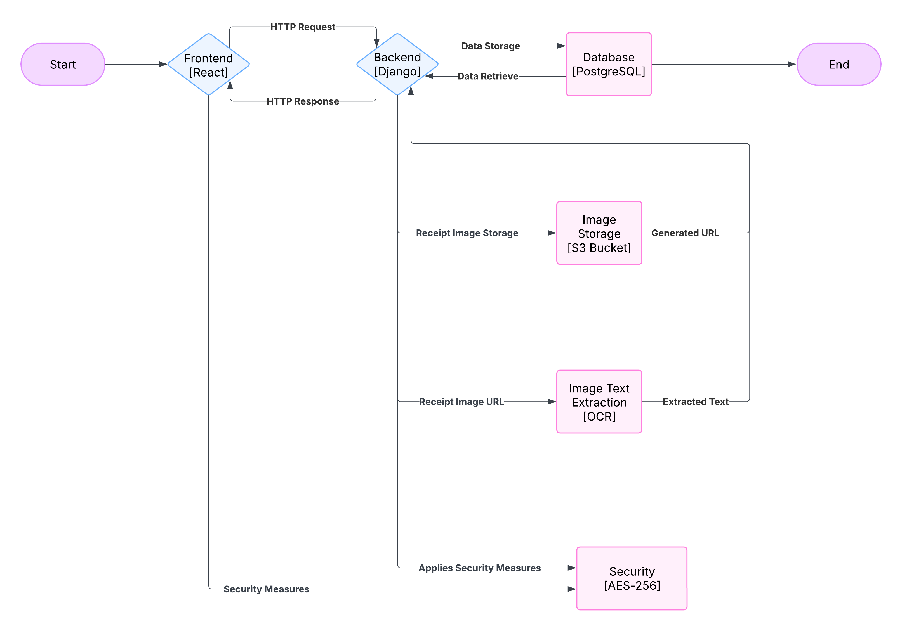

# System Design Document (SDD)

## Ohama Land - Sprint 1

### 1. Introduction
This document provides an overview of the system design for Ohama Land, including the class structure, system interactions, architecture, and error handling mechanisms. Since the system is in early development, the design may undergo changes in future iterations.

### 2. CRC Cards (Class-Responsibility-Collaborator)
The following tables represent the key classes, their responsibilities, and collaborators:

#### **Account Class**
| Class Name | User |
|------------|------|
| **Parent Class** | None |
| **Subclass** | None |
| **Responsibilities** | - Authenticate user   - Manage user profile   - Store user preferences |
| **Collaborators** | Receipt, Expense, Group |

#### **Receipt Class**
| Class Name | Receipt |
|------------|---------|
| **Parent Class** | None |
| **Subclass** | None |
| **Responsibilities** | - Store receipt data   - Process OCR   - Encrypt receipt content |
| **Collaborators** | User, OCRProcessor |

#### **Expense Class**
| Class Name | Expense |
|------------|---------|
| **Parent Class** | None |
| **Subclass** | None |
| **Responsibilities** | - Store expense details   - Link to receipts   - Assign payees & split costs |
| **Collaborators** | User, Receipt, Group |

#### **Group Class**
| Class Name | Group |
|------------|---------|
| **Parent Class** | None |
| **Subclass** | None |
| **Responsibilities** | - Manage group members   - Track shared expenses   - Simplify amount owed per person |
| **Collaborators** | User, Expense |

#### **OCRProcessor Class**
| Class Name | OCRProcessor |
|------------|-------------|
| **Parent Class** | None |
| **Subclass** | None |
| **Responsibilities** | - Extract text from receipt images   - Validate extracted data |
| **Collaborators** | Receipt |

### 3. System Interaction with the Environment
#### **Dependencies and Assumptions:**
- **Operating System**: Linux, Windows, macOS
- **Backend Framework**: Django (Python 3+)
- **Frontend Framework**: React.js (Next.js)
- **Database**: MongoDB (NoSQL) -> PostgreSQL
- **Storage**: AWS S3 for image storage
- **Security**: AES-256 for receipt encryption, protection against XSS, CSRF, SQL Injection

### 4. System Architecture
The system follows a modular architecture, dividing components into frontend, backend, and database layers.

#### **Components & Interactions:**
- **Frontend (React + MUI):** Sends API requests to the backend for authentication and receipt management.
- **Backend (Django + REST API):** Processes API requests, handles authentication, and performs CRUD operations.
- **Database (PostgreSQL):** Stores user, receipt, and group data.

**Architecture Diagram:**

### 5. System Decomposition
The system consists of the following major modules:
- **Account Module:** Handles authentication, profiles, and access control.
- **Receipt Module:** Manages user receipts, including storing images and financial data.
- **Group Module:** Enables users to form groups and manage shared expenses.

Each module interacts with the backend API and database to ensure data consistency.

### 6. Error Handling & Exception Strategy
The system handles the following error conditions:

| Error Type | Handling Strategy |
|------------|------------------|
| **Invalid User Input** | Validate inputs before processing, provide error messages. |
| **Network Failure** | Implement retry logic and offline storage for receipts. |
| **Security Breaches (XSS, CSRF, SQL Injection)** | Use Django’s built-in security features, input sanitization, and CSRF tokens. |
| **OCR Errors** | Allow user to manually correct extracted text. |

### 7. Conclusion
This document provides a high-level design overview of the Ohama Land system. Future iterations will refine these structures based on implementation feedback. The modular architecture ensures flexibility and scalability.
