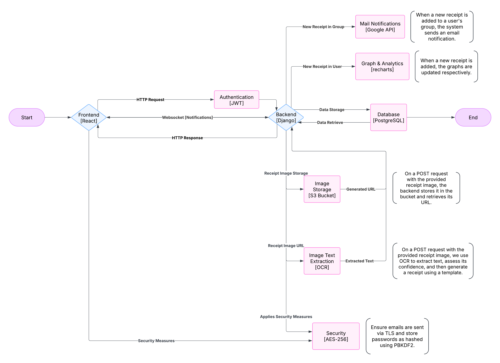

# System Design Document (SDD)

## Ohama Land - Sprint 4

### 1. Introduction
This document provides an overview of the system design for Ohama Land, including the class structure, system interactions, architecture, and error handling mechanisms. Since the system is in early development, the design may undergo changes in future iterations.

### 2. CRC Cards (Class-Responsibility-Collaborator)
The following tables represent the key classes, their responsibilities, and collaborators:

#### **GroupCard Component**
| Class Name | User |
|------------|------|
| **Parent Class** | None |
| **Subclass** | None |
| **Responsibilities** | - Defines GroupCard item    - Displays key group info   - Styling for each GroupCard |
| **Collaborators** | GroupFilter, GroupCard |

#### **GroupFilter Class**
| Class Name | User |
|------------|------|
| **Parent Class** | None |
| **Subclass** | None |
| **Responsibilities** | - Filters groups based on dates, terms, and search   - Styling for filters   - Store user preferences |
| **Collaborators** | GroupCard, GroupGrid |

#### **GroupGrid Class**
| Class Name | User |
|------------|------|
| **Parent Class** | None |
| **Subclass** | None |
| **Responsibilities** | - Lays out the grid for the GroupCards |
| **Collaborators** | GroupCard, GroupFilter |

#### **ReceiptDialog Component**
| Class Name | User |
|------------|------|
| **Parent Class** | None |
| **Subclass** | None |
| **Responsibilities** | - Displays Receipt upload popup contents   - Allows user to add Receipt info |
| **Collaborators** | AddReceipt, FileUpload, ReceiptCard, ReceiptFilter, ReceiptGrid |

#### **AddReceipt Component**
| Class Name | User |
|------------|------|
| **Parent Class** | None |
| **Subclass** | None |
| **Responsibilities** | - Handles Receipt Info   - Allows users to save receipts content to database |
| **Collaborators** | ReceiptDialog, FileUpload, ReceiptCard, ReceiptFilter, ReceiptGrid |

#### **FileUpload Component**
| Class Name | User |
|------------|------|
| **Parent Class** | None |
| **Subclass** | None |
| **Responsibilities** | - Handles File upload when adding Receipts   - Allows users to upload a picture of Receipt to store |
| **Collaborators** | ReceiptDialog, FileUpload, ReceiptCard, ReceiptFilter, ReceiptGrid |

#### ReceiptFilter Component
| Class Name | ReceiptFilter |
|------------|--------------|
| Parent Class | None |
| Subclass | None |
| Responsibilities | - Provides UI for filtering receipts   - Includes search bar, date filters, and category selector   - Manages user input and passes state changes to parent |
| Collaborators | ReceiptGrid, DropDownSelector |

#### ReceiptGrid Component
| Class Name | ReceiptGrid |
|------------|------------|
| Parent Class | None |
| Subclass | None |
| Responsibilities | - Displays filtered receipts in a grid layout   - Uses ReceiptCard to render individual receipts   - Calls filtering function on receipt data |
| Collaborators | ReceiptFilter, ReceiptCard |

#### ReceiptCard Component
| Class Name | ReceiptCard |
|------------|------------|
| Parent Class | None |
| Subclass | None |
| Responsibilities | - Represents an individual receipt   - Displays key receipt information including date, merchant, payment method, and total amount   - Allows user interaction to view receipt details |
| Collaborators | ReceiptGrid |

#### **User Class**
| Class Name | User |
|------------|------|
| **Parent Class** | None |
| **Subclass** | None |
| **Responsibilities** | - Authenticate user   - Manage user profile   - Store user preferences |
| **Collaborators** | Receipt, Expense, Group |

#### **Receipt Class**
| Class Name | Receipt |
|------------|---------|
| **Parent Class** | None |
| **Subclass** | None |
| **Responsibilities** | - Store receipt data   - Process OCR   - Encrypt receipt content |
| **Collaborators** | User, OCRProcessor |

#### **Item Class**
| Class Name | Receipt |
|------------|---------|
| **Parent Class** | None |
| **Subclass** | None |
| **Responsibilities** | - Store specific items from a receipt |
| **Collaborators** | Receipt |

#### **Expense Class**
| Class Name | Expense |
|------------|---------|
| **Parent Class** | None |
| **Subclass** | None |
| **Responsibilities** | - Store expense details   - Link to receipts   - Assign payees & split costs |
| **Collaborators** | User, Receipt, Group |

#### **Group Class**
| Class Name | Group |
|------------|---------|
| **Parent Class** | None |
| **Subclass** | None |
| **Responsibilities** | - Manage group members   - Track shared expenses   - Simplify amount owed per person |
| **Collaborators** | User, Expense |

#### **OCRProcessor Class**
| Class Name | OCRProcessor |
|------------|-------------|
| **Parent Class** | None |
| **Subclass** | None |
| **Responsibilities** | - Extract text from receipt images   - Validate extracted data |
| **Collaborators** | Receipt |

#### **Subscription Class**
| Class Name | Subscription |
|------------|-------------|
| **Parent Class** | None |
| **Subclass** | None |
| **Responsibilities** | - Store user subscriptions with renewal dates |
| **Collaborators** | None |

#### **Notification Class**
| Class Name | Notification |
|------------|-------------|
| **Parent Class** | None |
| **Subclass** | None |
| **Responsibilities** | - Store in-app notifications for a specific user |
| **Collaborators** | Receipt, Subscription |

### 3. System Interaction with the Environment
#### **Dependencies and Assumptions:**
- **Operating System**: Linux, Windows, macOS
- **Backend Framework**: Django (Python 3+)
- **Frontend Framework**: React.js (Next.js)
- **Database**: PostgreSQL
- **Storage**: AWS S3 for image storage
- **OCR**: OpenAI API
- **Analytics**: Recharts for graphical analytics
- **Security**: AES-256 for receipt encryption, protection against XSS, CSRF, SQL Injection

### 4. System Architecture
The system follows a modular architecture, dividing components into frontend, backend, and database layers.

#### **Components & Interactions:**
- **Frontend (React + MUI):** Sends API requests to the backend for authentication and receipt management.
- **Backend (Django + REST API):** Processes API requests, handles authentication, and performs CRUD operations.
- **Database (PostgreSQL):** Stores user, receipt, and group data.

**Architecture Diagram:**

### 5. System Decomposition
The system consists of the following major modules:
- **User Module:** Handles authentication, profiles, and access control.
- **Receipt Module:** Manages user receipts, including storing images and financial data.
- **Group Module:** Enables users to form groups and manage shared expenses.
- **Analytics Module:** Display visual graphs of the user's receipt analytics.
- **Subscription Module:** Enables users to track their subscriptions.

Each module interacts with the backend API and database to ensure data consistency.

### 6. Error Handling & Exception Strategy
The system handles the following error conditions:

| Error Type | Handling Strategy |
|------------|------------------|
| **Invalid User Input** | Validate inputs before processing, provide error messages. |
| **Network Failure** | Implement retry logic and offline storage for receipts. |
| **Security Breaches (XSS, CSRF, SQL Injection)** | Use Django’s built-in security features, input sanitization, and CSRF tokens. |
| **OCR Errors** | Display confidence score for extracted data. Implement manual correction interface for low-confidence extractions. |

### 7. Conclusion
This document provides a high-level design overview of the Ohama Land system. Future iterations will refine these structures based on implementation feedback. The modular architecture ensures flexibility and scalability.
